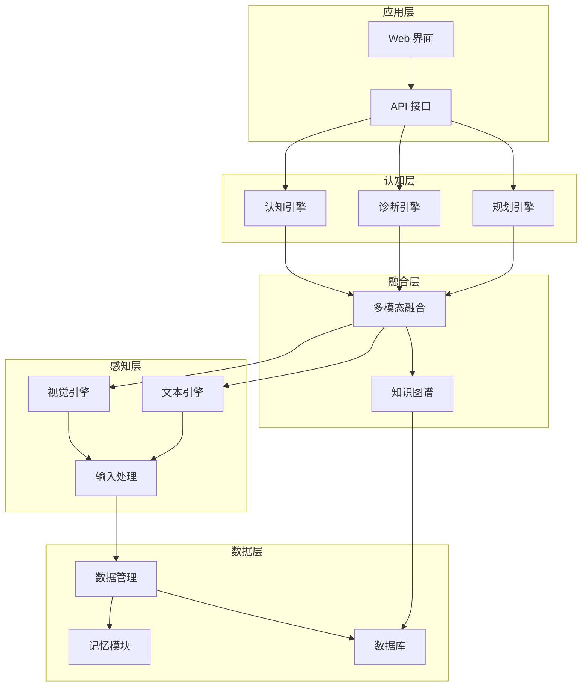

# 项目架构文档

## 整体架构

项目采用分层架构设计，从底层到上层依次为：数据层、感知层、融合层、认知层和应用层。各层之间通过明确的接口进行交互，确保系统的模块化和可扩展性。

## 模块关系

### 1. 数据层

- **Data 模块**：负责数据的管理和处理，包括数据加载、预处理和增强
- **Memory 模块**：存储系统的记忆和历史数据，支持系统的学习和进化
- **Database 模块**：管理持久化数据，包括病例记录和知识图谱数据

### 2. 感知层

- **Vision 模块**：处理图像输入，使用 YOLO 模型进行目标检测和识别
- **Text 模块**：处理文本输入，包括自然语言理解和处理
- **Input 模块**：统一处理各种输入数据，进行格式转换和验证

### 3. 融合层

- **Fusion 模块**：整合多模态信息，包括图像和文本数据的融合
- **Graph 模块**：管理知识图谱，提供知识推理和查询功能

### 4. 认知层

- **Cognition 模块**：负责系统的认知和推理能力，使用大语言模型进行文本理解和生成
- **Diagnosis 模块**：核心诊断逻辑，基于融合后的信息进行病害诊断
- **Planning 模块**：负责系统的任务规划和执行

### 5. 应用层

- **Web 模块**：提供用户界面，包括前端和后端
- **API 模块**：提供 RESTful API 接口，支持外部系统集成

## 核心组件

### 视觉引擎

- **YOLO 模型**：用于小麦病害的目标检测和识别
- **视觉预处理**：图像增强、缩放和标准化
- **后处理**：检测结果的过滤和优化

### 多模态融合

- **跨模态注意力**：整合图像和文本信息
- **特征提取**：从不同模态中提取有意义的特征
- **融合策略**：多种融合方法的实现

### 知识图谱

- **Neo4j 数据库**：存储和管理知识图谱数据
- **知识推理**：基于图谱的推理和查询
- **知识更新**：支持知识的动态更新和扩展

### 诊断引擎

- **诊断规则**：基于规则的诊断逻辑
- **机器学习模型**：基于数据的诊断模型
- **结果解释**：生成诊断结果的解释和建议

### Web 系统

- **前端**：Vue.js 实现的用户界面
- **后端**：FastAPI 实现的 API 服务
- **数据库**：存储用户数据和诊断记录

## 数据流

1. **输入处理**：
   - 接收用户输入（图像、文本等）
   - 进行格式验证和预处理
   - 转换为系统内部格式

2. **感知处理**：
   - 视觉模块处理图像，检测病害
   - 文本模块处理描述信息
   - 生成初步的感知结果

3. **多模态融合**：
   - 整合视觉和文本信息
   - 利用知识图谱进行增强
   - 生成融合特征

4. **诊断推理**：
   - 基于融合特征进行诊断
   - 生成诊断结果和置信度
   - 提供详细的诊断报告

5. **结果输出**：
   - 通过 API 接口返回结果
   - 在 Web 界面展示诊断结果
   - 存储诊断记录到数据库

## 扩展点

1. **模型扩展**：
   - 支持新的视觉模型和语言模型
   - 提供模型训练和优化接口

2. **知识图谱扩展**：
   - 支持知识的动态更新
   - 提供知识图谱构建和管理工具

3. **部署扩展**：
   - 支持边缘设备部署
   - 提供容器化部署方案

4. **功能扩展**：
   - 支持新的诊断类型
   - 提供个性化的诊断服务

## 技术架构特点

1. **模块化设计**：各模块职责清晰，接口明确
2. **多模态融合**：整合图像和文本信息，提高诊断准确性
3. **知识驱动**：利用知识图谱增强诊断能力
4. **可扩展性**：支持模型和功能的扩展
5. **实时性**：优化推理速度，支持实时诊断
6. **可靠性**：完善的错误处理和容错机制
