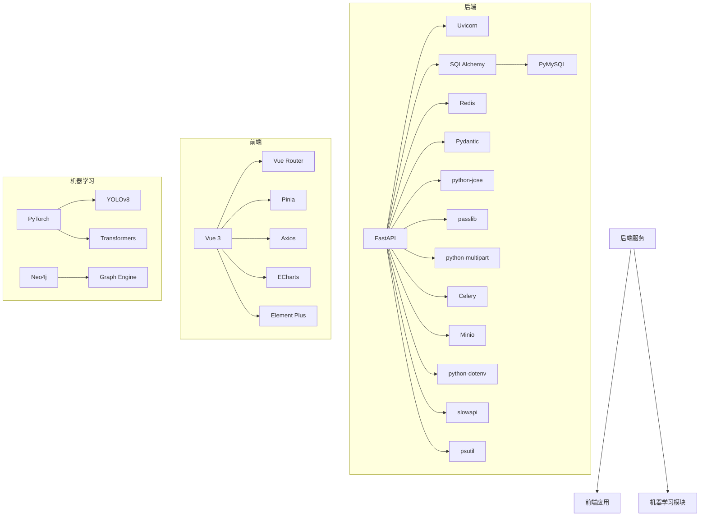

# 依赖关系分析

## 项目依赖概览

项目包含前端和后端两部分，分别有各自的依赖项。以下是主要依赖的分析：

## 后端依赖

### 核心依赖

| 依赖 | 版本 | 用途 | 来源 |
|------|------|------|------|
| fastapi | >=0.109.0 | Web 框架，提供 RESTful API | src/web/backend/requirements.txt |
| uvicorn | >=0.27.0 | ASGI 服务器，用于运行 FastAPI 应用 | src/web/backend/requirements.txt |
| sqlalchemy | >=2.0.0 | ORM 框架，用于数据库操作 | src/web/backend/requirements.txt |
| pymysql | >=1.1.0 | MySQL 数据库驱动 | src/web/backend/requirements.txt |
| redis | >=5.0.0 | 缓存数据库，用于提高性能 | src/web/backend/requirements.txt |
| python-jose | >=3.3.0 | JWT 库，用于用户认证 | src/web/backend/requirements.txt |
| passlib | >=1.7.4 | 密码哈希库，用于安全存储密码 | src/web/backend/requirements.txt |
| python-multipart | >=0.0.6 | 处理文件上传 | src/web/backend/requirements.txt |
| pydantic | >=2.5.0 | 数据验证库，用于请求和响应模型 | src/web/backend/requirements.txt |
| celery | >=5.3.0 | 任务队列，用于处理异步任务 | src/web/backend/requirements.txt |
| minio | >=7.1.0 | 对象存储客户端，用于存储图像等文件 | src/web/backend/requirements.txt |
| python-dotenv | >=1.0.0 | 环境变量管理 | src/web/backend/requirements.txt |
| slowapi | >=0.1.9 | API 速率限制 | src/web/backend/requirements.txt |
| psutil | >=5.9.0 | 系统资源监控 | src/web/backend/requirements.txt |

### 机器学习依赖

项目还依赖以下机器学习相关的库（从代码结构推断）：

| 依赖 | 用途 |
|------|------|
| PyTorch | 深度学习框架，用于模型训练和推理 |
| YOLOv8 | 目标检测模型，用于小麦病害检测 |
| Transformers | NLP 库，用于大语言模型 |
| Neo4j | 图数据库，用于知识图谱 |

## 前端依赖

### 核心依赖

| 依赖 | 版本 | 用途 | 来源 |
|------|------|------|------|
| vue | ^3.5.25 | 前端框架 | src/web/frontend/package.json |
| vue-router | ^5.0.3 | 路由管理 | src/web/frontend/package.json |
| pinia | ^3.0.4 | 状态管理 | src/web/frontend/package.json |
| axios | ^1.13.6 | HTTP 客户端，用于 API 调用 | src/web/frontend/package.json |
| echarts | ^6.0.0 | 数据可视化库 | src/web/frontend/package.json |
| element-plus | ^2.13.5 | UI 组件库 | src/web/frontend/package.json |

### 开发依赖

| 依赖 | 版本 | 用途 | 来源 |
|------|------|------|------|
| typescript | ~5.9.3 | TypeScript 支持 | src/web/frontend/package.json |
| vite | ^7.3.1 | 构建工具 | src/web/frontend/package.json |
| vitest | ^2.0.0 | 测试框架 | src/web/frontend/package.json |
| vue-tsc | ^3.1.5 | Vue TypeScript 编译器 | src/web/frontend/package.json |
| unplugin-auto-import | ^0.18.6 | 自动导入工具 | src/web/frontend/package.json |
| unplugin-vue-components | ^0.27.5 | 组件自动注册 | src/web/frontend/package.json |

## 依赖关系图



## 依赖关系说明

### 后端依赖关系

1. **FastAPI** 是后端的核心框架，依赖于：
   - **Uvicorn**：作为 ASGI 服务器运行 FastAPI 应用
   - **SQLAlchemy**：提供 ORM 功能，与数据库交互
   - **Redis**：用于缓存和会话管理
   - **Pydantic**：用于数据验证和序列化
   - **python-jose**：用于 JWT 令牌生成和验证
   - **passlib**：用于密码哈希
   - **python-multipart**：处理文件上传
   - **Celery**：处理异步任务
   - **Minio**：用于对象存储
   - **python-dotenv**：管理环境变量
   - **slowapi**：API 速率限制
   - **psutil**：系统资源监控

2. **SQLAlchemy** 依赖于 **PyMySQL** 作为 MySQL 数据库驱动。

### 前端依赖关系

1. **Vue 3** 是前端的核心框架，依赖于：
   - **Vue Router**：管理前端路由
   - **Pinia**：状态管理
   - **Axios**：HTTP 客户端，用于调用后端 API
   - **ECharts**：数据可视化
   - **Element Plus**：UI 组件库

2. **开发依赖**：
   - **TypeScript**：提供类型支持
   - **Vite**：构建工具
   - **Vitest**：测试框架
   - **vue-tsc**：Vue TypeScript 编译器
   - **unplugin-auto-import**：自动导入工具
   - **unplugin-vue-components**：组件自动注册

### 机器学习依赖关系

1. **PyTorch** 是机器学习的核心框架，依赖于：
   - **YOLOv8**：用于目标检测
   - **Transformers**：用于 NLP 任务

2. **Neo4j** 是知识图谱的核心，依赖于：
   - **Graph Engine**：知识图谱引擎

## 依赖版本管理

### 后端依赖管理

后端使用 `requirements.txt` 文件管理依赖，指定了每个依赖的最低版本要求。这种方式简单直接，但可能会导致版本冲突。建议考虑使用 `poetry` 或 `pipenv` 等工具进行更精确的依赖管理。

### 前端依赖管理

前端使用 `package.json` 文件管理依赖，使用 npm 或 yarn 进行安装。版本号使用语义化版本控制，确保依赖的稳定性。

## 依赖冲突处理

项目中可能出现的依赖冲突包括：

1. **版本冲突**：不同依赖要求同一包的不同版本
2. **依赖缺失**：某些依赖未正确安装
3. **兼容性问题**：依赖之间存在兼容性问题

### 解决方法

1. **版本锁定**：使用 `requirements.txt` 或 `package-lock.json` 锁定依赖版本
2. **依赖分析**：使用 `pip check` 或 `npm ls` 分析依赖关系
3. **虚拟环境**：使用虚拟环境隔离依赖
4. **依赖升级**：定期更新依赖到兼容版本

## 依赖安全

### 安全风险

1. **过时依赖**：使用存在安全漏洞的旧版本依赖
2. **恶意依赖**：包含恶意代码的依赖包
3. **依赖链攻击**：通过依赖的依赖引入安全问题

### 安全措施

1. **定期更新**：定期更新依赖到最新的安全版本
2. **安全扫描**：使用 `pip-audit` 或 `npm audit` 扫描安全漏洞
3. **依赖审查**：审查新引入的依赖
4. **最小化依赖**：只引入必要的依赖

## 依赖安装指南

### 后端依赖安装

```bash
# 进入后端目录
cd src/web/backend

# 安装依赖
pip install -r requirements.txt

# 安装机器学习依赖（根据需要）
pip install torch torchvision
pip install ultralytics  # YOLOv8
pip install transformers
pip install neo4j-driver
```

### 前端依赖安装

```bash
# 进入前端目录
cd src/web/frontend

# 安装依赖
npm install

# 构建项目
npm run build
```

## 依赖监控

建议定期监控依赖的更新和安全状态，确保项目的稳定性和安全性。可以使用以下工具：

- **Dependabot**：自动监控和更新依赖
- **Snyk**：检测依赖中的安全漏洞
- **PyUp**：监控 Python 依赖的更新
