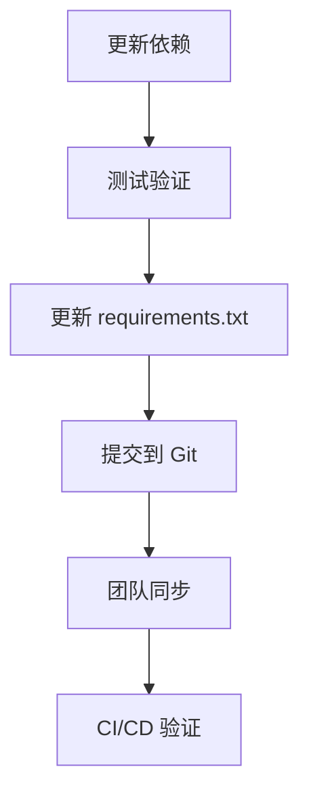
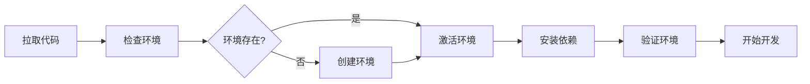

# 基于多模态融合的小麦病害诊断系统 - 环境管理规则文档

**生成日期**: 2026-04-05
**版本**: V12.0
**最后更新**: 2026-04-05 (V7 文档标准化)
**项目**: 基于多模态融合的小麦病害诊断系统

---

## 目录

1. [环境命名规范与用途说明](#1-环境命名规范与用途说明)
2. [环境激活与停用流程](#2-环境激活与停用流程)
3. [包安装与管理指南](#3-包安装与管理指南)
4. [环境备份与恢复协议](#4-环境备份与恢复协议)
5. [依赖文档要求](#5-依赖文档要求)
6. [环境激活验证步骤](#6-环境激活验证步骤)
7. [包依赖冲突解决策略](#7-包依赖冲突解决策略)
8. [环境配置文件版本控制建议](#8-环境配置文件版本控制建议)
9. [环境管理安全考虑](#9-环境管理安全考虑)
10. [团队环境一致性最佳实践](#10-团队环境一致性最佳实践)

---

## 1. 环境命名规范与用途说明

### 1.1 当前项目 Conda 环境列表

| 环境名称 | Python 版本 | 路径 | 用途 | 状态 |
|---------|------------|------|------|------|
| `wheatagent-py310` | 3.10.x | `C:\Users\Administrator\.conda\envs\wheatagent-py310` | **主开发环境** | ✅ 推荐使用 |
| `labeling_tool` | - | `C:\Users\Administrator\.conda\envs\labeling_tool` | 数据标注工具环境 | 辅助环境 |
| `base` | 3.13.x | `D:\Miniconda3` | Miniconda 基础环境 | ⚠️ 不推荐用于开发 |

### 1.2 环境命名规范

```
<项目名>-py<主版本号><次版本号>
```

**示例**:
- `wheatagent-py310` → 小麦病害诊断系统项目, Python 3.10
- `wheatagent-py311` → 小麦病害诊断系统项目, Python 3.11

### 1.3 各环境用途详解

#### wheatagent-py310 (主开发环境)

**用途**: 小麦病害诊断系统核心开发环境

**包含组件**:
- PyTorch 2.10.0+cu126 (CUDA 12.6 支持)
- Ultralytics YOLOv8
- Transformers 5.1.0 (Qwen3-VL-2B-Instruct 支持)
- Qwen3-VL-2B-Instruct 原生多模态大语言模型
- Neo4j 驱动
- Vue 3 Web界面
- bitsandbytes 0.49.1 (4bit 量化支持)

**适用场景**:
- 视觉检测模型训练
- Qwen3-VL-2B-Instruct 原生多模态推理
- 知识图谱操作
- 端到端诊断流程
- 低显存环境下的模型推理 (4bit 量化)

#### labeling_tool (辅助环境)

**用途**: 数据标注工具专用环境

**适用场景**:
- 病害图像标注
- 边界框绘制
- 数据集预处理

#### base (基础环境)

**用途**: Miniconda 默认环境

**警告**: 
- ⚠️ 不推荐在此环境进行项目开发
- ⚠️ Python 3.13 可能存在兼容性问题
- ⚠️ 缺少项目所需的核心依赖

---

## 2. 环境激活与停用流程

### 2.1 Windows PowerShell 环境激活

```powershell
# 方法 1: 使用 conda activate
conda activate wheatagent-py310

# 方法 2: 直接使用 Python 解释器路径
C:\Users\Administrator\.conda\envs\wheatagent-py310\python.exe <script.py>
```

### 2.2 Windows CMD 环境激活

```cmd
conda activate wheatagent-py310
```

### 2.3 环境停用

```powershell
# 停用当前环境
conda deactivate

# 返回 base 环境
conda activate base
```

### 2.4 环境激活验证

激活环境后，应验证以下内容：

```powershell
# 检查当前环境
conda info --envs

# 检查 Python 版本
python --version
# 预期输出: Python 3.10.x

# 检查 PyTorch 和 CUDA
python -c "import torch; print(f'PyTorch: {torch.__version__}'); print(f'CUDA: {torch.cuda.is_available()}')"
# 预期输出: PyTorch: 2.10.0+cu126, CUDA: True
```

### 2.5 快速激活脚本

项目提供快速激活脚本：

```powershell
# 运行激活脚本
.\scripts\utils\activate_env.ps1
```

---

## 3. 包安装与管理指南

### 3.1 包安装命令

```powershell
# 确保在正确的环境中
conda activate wheatagent-py310

# 使用 pip 安装包 (推荐)
pip install <package_name>

# 使用 conda 安装包
conda install -c conda-forge <package_name>

# 从 PyTorch 官方源安装 (GPU 版本)
pip install torch torchvision --index-url https://download.pytorch.org/whl/cu121
```

### 3.2 批量安装依赖

```powershell
# 从 requirements.txt 安装
pip install -r requirements.txt

# 安装开发依赖
pip install -r requirements-dev.txt
```

### 3.3 包更新策略

```powershell
# 更新单个包
pip install --upgrade <package_name>

# 更新 pip 自身
pip install --upgrade pip

# 查看可更新的包
pip list --outdated
```

### 3.4 包卸载

```powershell
# 卸载单个包
pip uninstall <package_name>

# 卸载多个包
pip uninstall <package1> <package2>
```

### 3.5 关键包版本要求

| 包名 | 最低版本 | 推荐版本 | 说明 |
|------|---------|---------|------|
| `torch` | 2.0.0 | 2.10.0+cu126 | GPU 支持必需 |
| `ultralytics` | 8.0.0 | 8.4.13 | YOLOv8 核心 |
| `transformers` | 4.30.0 | 5.1.0 | Qwen3.5 支持 |
| `neo4j` | 5.14.0 | 6.1.0 | 知识图谱驱动 |
| `opencv-python` | 4.8.0 | 4.13.0 | 图像处理 |
| `peft` | 0.5.0 | 0.18.1 | LoRA 微调支持 |
| `modelscope` | 1.10.0 | 1.22.0 | 模型下载工具 |
| `bitsandbytes` | 0.41.0 | 0.49.1 | 4bit量化支持 |
| `accelerate` | 0.20.0 | 1.0.0 | 模型加载优化 |
| `safetensors` | 0.4.0 | 0.5.0 | 安全张量格式 |

### 3.6 Qwen3-VL-2B-Instruct 相关依赖说明

Qwen3-VL-2B-Instruct 是通义千问系列的原生多模态大语言模型，支持文本和图像理解。以下是相关依赖配置：

**核心依赖**:
```powershell
# 安装 Qwen3-VL-2B-Instruct 核心依赖
pip install transformers>=5.1.0
pip install accelerate>=1.0.0
pip install safetensors>=0.5.0
pip install bitsandbytes>=0.49.1  # 4bit 量化支持
pip install modelscope>=1.22.0    # 模型下载
```

**模型加载示例**:
```python
from transformers import AutoModelForVision2Seq, AutoTokenizer

model_name = "Qwen/Qwen3-VL-2B-Instruct"

tokenizer = AutoTokenizer.from_pretrained(model_name, trust_remote_code=True)
model = AutoModelForVision2Seq.from_pretrained(
    model_name,
    torch_dtype="auto",
    device_map="auto",
    trust_remote_code=True
)
```

### 3.7 4bit 量化支持说明

4bit 量化可显著降低显存占用，适用于低显存 GPU 环境。

**启用 4bit 量化**:
```python
from transformers import BitsAndBytesConfig

quantization_config = BitsAndBytesConfig(
    load_in_4bit=True,
    bnb_4bit_quant_type="nf4",
    bnb_4bit_compute_dtype=torch.float16,
    bnb_4bit_use_double_quant=True
)

model = AutoModelForVision2Seq.from_pretrained(
    "Qwen/Qwen3-VL-2B-Instruct",
    quantization_config=quantization_config,
    device_map="auto",
    trust_remote_code=True
)
```

**显存占用对比**:
| 精度 | Qwen3-VL-2B-Instruct 显存占用 | 适用 GPU |
|------|------------------------------|----------|
| FP16 | ~8 GB | RTX 3060 12GB+ |
| 4bit | ~3 GB | RTX 3050 4GB+ |

**注意事项**:
- 4bit 量化需要 `bitsandbytes>=0.41.0`
- Windows 系统需安装预编译版本的 bitsandbytes
- 量化可能导致轻微精度损失

---

## 4. 环境备份与恢复协议

### 4.1 环境导出

```powershell
# 激活目标环境
conda activate wheatagent-py310

# 导出完整环境配置
conda env export > environment.yml

# 导出 pip 依赖列表
pip freeze > requirements.txt

# 导出带版本锁定的依赖
pip freeze | grep -i "package" > requirements-lock.txt
```

### 4.2 环境恢复

```powershell
# 从 environment.yml 恢复
conda env create -f environment.yml

# 从 requirements.txt 安装
pip install -r requirements.txt
```

### 4.3 环境克隆

```powershell
# 克隆现有环境
conda create --name wheatagent-py310-backup --clone wheatagent-py310
```

### 4.4 环境备份策略

**建议备份频率**:
- 每次重大依赖更新后
- 每周自动备份
- 项目里程碑节点

**备份文件命名规范**:
```
environment_<YYYYMMDD>_<version>.yml
requirements_<YYYYMMDD>.txt
```

**示例**:
```
environment_20260226_v1.0.yml
requirements_20260226.txt
```

---

## 5. 依赖文档要求

### 5.1 requirements.txt 规范

项目 `requirements.txt` 应包含：

```txt
# ==================== 分类标题 ====================
# 核心依赖
package_name>=min_version

# 可选依赖 (注释说明用途)
# optional_package>=version  # 用途说明
```

### 5.2 environment.yml 规范

```yaml
name: wheatagent-py310
channels:
  - pytorch
  - conda-forge
  - defaults
dependencies:
  - python=3.10
  - pip
  - pip:
    - -r requirements.txt
```

### 5.3 依赖更新日志

每次依赖更新应记录：

```markdown
## 2026-03-09 依赖更新
- 新增: Qwen3-VL-2B-Instruct 原生多模态模型支持
- 更新: transformers 4.30.0 → 5.1.0 (Qwen3-VL 支持)
- 更新: bitsandbytes 0.41.0 → 0.49.1 (4bit 量化优化)
- 更新: accelerate 0.20.0 → 1.0.0 (模型加载优化)
- 更新: safetensors 0.4.0 → 0.5.0 (安全张量格式)
- 原因: Qwen3-VL-2B-Instruct 原生多模态模型集成

## 2026-03-04 依赖更新
- 新增: peft>=0.18.1 (LoRA 微调支持)
- 更新: torch 2.0.0 → 2.10.0+cu126
- 移除: 旧版本 tensorboard
- 原因: CUDA 12.6 兼容性
```

---

## 6. 环境激活验证步骤

### 6.1 标准验证流程

```powershell
# Step 1: 激活环境
conda activate wheatagent-py310

# Step 2: 验证 Python 版本
python --version
# 预期: Python 3.10.x

# Step 3: 验证 PyTorch
python -c "import torch; print(torch.__version__)"
# 预期: 2.10.0+cu126

# Step 4: 验证 CUDA
python -c "import torch; print(torch.cuda.is_available())"
# 预期: True

# Step 5: 验证 GPU 信息
python -c "import torch; print(torch.cuda.get_device_name(0))"
# 预期: NVIDIA GeForce RTX 3050 Laptop GPU

# Step 6: 验证核心包
python -c "import ultralytics; print(ultralytics.__version__)"
python -c "import transformers; print(transformers.__version__)"
```

### 6.2 快速验证脚本

创建 `scripts/utils/verify_env.py`:

```python
"""
环境验证脚本

验证项目环境是否正确配置
"""
import sys

def verify_environment():
    """验证环境配置"""
    print("=" * 50)
    print("小麦病害诊断系统环境验证")
    print("=" * 50)
    
    # Python 版本
    print(f"\n[1] Python 版本: {sys.version}")
    assert sys.version_info >= (3, 10), "Python 版本需 >= 3.10"
    
    # PyTorch
    try:
        import torch
        print(f"[2] PyTorch 版本: {torch.__version__}")
        print(f"[3] CUDA 可用: {torch.cuda.is_available()}")
        if torch.cuda.is_available():
            print(f"[4] GPU: {torch.cuda.get_device_name(0)}")
    except ImportError:
        print("[错误] PyTorch 未安装")
        return False
    
    # Ultralytics
    try:
        import ultralytics
        print(f"[5] Ultralytics 版本: {ultralytics.__version__}")
    except ImportError:
        print("[警告] Ultralytics 未安装")
    
    # Transformers
    try:
        import transformers
        print(f"[6] Transformers 版本: {transformers.__version__}")
    except ImportError:
        print("[警告] Transformers 未安装")
    
    print("\n" + "=" * 50)
    print("环境验证完成!")
    print("=" * 50)
    return True

if __name__ == "__main__":
    verify_environment()
```

**运行验证**:
```powershell
python scripts/utils/verify_env.py
```

---

## 7. 包依赖冲突解决策略

### 7.1 常见冲突场景

| 冲突类型 | 症状 | 解决方案 |
|---------|------|---------|
| CUDA 版本不匹配 | `RuntimeError: CUDA error` | 重装匹配版本的 PyTorch |
| 包版本冲突 | `ImportError` 或 `AttributeError` | 使用虚拟环境隔离 |
| 系统包冲突 | 安装失败 | 使用 `--user` 或 conda |

### 7.2 冲突诊断命令

```powershell
# 检查包依赖关系
pip check

# 查看包详细信息
pip show <package_name>

# 查看包依赖树
pip install pipdeptree
pipdeptree

# 检查冲突
pipdeptree --warn-silence
```

### 7.3 解决策略

#### 策略 1: 创建新环境

```powershell
# 创建全新环境
conda create -n wheatagent-new python=3.10 -y
conda activate wheatagent-new
pip install -r requirements.txt
```

#### 策略 2: 使用版本锁定

```powershell
# 安装确切版本
pip install package==1.2.3

# 使用 requirements-lock.txt
pip install -r requirements-lock.txt
```

#### 策略 3: 分步安装

```powershell
# 先安装核心依赖
pip install torch torchvision --index-url https://download.pytorch.org/whl/cu121

# 再安装其他依赖
pip install -r requirements.txt
```

### 7.4 CUDA 兼容性矩阵

| PyTorch 版本 | CUDA 版本 | Python 版本 | Qwen3-VL-2B-Instruct 支持 |
|-------------|----------|------------|--------------------------|
| 2.10.0 | 12.6 | 3.10+ | ✅ 完全支持 |
| 2.5.0 | 12.1 | 3.9+ | ✅ 支持 |
| 2.0.0 | 11.8 | 3.8+ | ⚠️ 部分功能受限 |

**Qwen3-VL-2B-Instruct CUDA 要求**:
- 推荐: CUDA 12.1+ (完整功能支持)
- 最低: CUDA 11.8 (基础推理)
- 4bit 量化: CUDA 11.8+ (需 bitsandbytes 支持)

---

## 8. 环境配置文件版本控制建议

### 8.1 应纳入版本控制的文件

```
项目根目录/
├── requirements.txt          # ✅ 必须纳入
├── requirements-dev.txt      # ✅ 开发依赖
├── environment.yml           # ✅ Conda 环境配置
├── pyproject.toml           # ✅ 项目配置 (可选)
└── .python-version          # ✅ Python 版本锁定
```

### 8.2 .gitignore 配置

```gitignore
# 环境文件
.env
.venv/
venv/
__pycache__/

# Conda
.conda/

# 缓存
.cache/
pip-cache/

# 本地环境备份
environment_local.yml
requirements_local.txt
```

### 8.3 版本控制工作流



### 8.4 依赖更新 PR 模板

```markdown
## 依赖更新 PR

### 更新内容
- [ ] 新增依赖
- [ ] 更新版本
- [ ] 移除依赖

### 变更详情
| 包名 | 旧版本 | 新版本 | 原因 |
|------|-------|-------|------|
| torch | 2.0.0 | 2.10.0 | CUDA 12.6 支持 |

### 测试结果
- [ ] 环境验证通过
- [ ] 单元测试通过
- [ ] 集成测试通过
```

---

## 9. 环境管理安全考虑

### 9.1 敏感信息保护

**禁止在环境配置中包含**:
- API 密钥
- 数据库密码
- 私有 Token
- 私有仓库地址

**使用环境变量替代**:
```powershell
# 设置环境变量
$env:NEO4J_PASSWORD = "your_password"
$env:HUGGINGFACE_TOKEN = "your_token"
```

### 9.2 包来源安全

```powershell
# 仅从可信源安装
pip install --trusted-host pypi.org --trusted-host files.pythonhosted.org <package>

# 验证包签名
pip install --require-hashes -r requirements.txt
```

### 9.3 漏洞扫描

```powershell
# 安装安全扫描工具
pip install safety

# 扫描依赖漏洞
safety check -r requirements.txt

# 使用 pip-audit
pip install pip-audit
pip-audit
```

### 9.4 最小权限原则

```powershell
# 不使用 sudo/root 安装
# 使用用户级安装
pip install --user <package>

# 或使用虚拟环境
python -m venv .venv
```

---

## 10. 团队环境一致性最佳实践

### 10.1 环境同步流程



### 10.2 团队成员环境设置

**新成员首次设置**:

```powershell
# Step 1: 克隆项目
git clone <repository_url>
cd 项目根目录

# Step 2: 创建 Conda 环境
conda create -n wheatagent-py310 python=3.10 -y

# Step 3: 激活环境
conda activate wheatagent-py310

# Step 4: 安装依赖
pip install -r requirements.txt

# Step 5: 验证环境
python scripts/utils/verify_env.py
```

### 10.3 环境同步检查清单

- [ ] Python 版本一致 (3.10.x)
- [ ] PyTorch 版本一致 (2.10.0+cu126)
- [ ] CUDA 版本兼容 (12.6)
- [ ] 核心包版本一致
- [ ] 环境验证脚本通过

### 10.4 定期同步机制

**建议频率**: 每周或每次依赖更新后

```powershell
# 同步最新依赖
git pull
pip install -r requirements.txt --upgrade
python scripts/utils/verify_env.py
```

### 10.5 CI/CD 环境配置

**GitHub Actions 示例**:

```yaml
name: Environment Check

on: [push, pull_request]

jobs:
  verify:
    runs-on: windows-latest
    steps:
      - uses: actions/checkout@v4
      
      - name: Set up Python
        uses: actions/setup-python@v5
        with:
          python-version: '3.10'
      
      - name: Install dependencies
        run: |
          pip install -r requirements.txt
      
      - name: Verify environment
        run: |
          python scripts/utils/verify_env.py
      
      - name: Run tests
        run: |
          pytest tests/
```

---

## 附录

### A. 快速参考命令

```powershell
# 环境管理
conda env list                    # 列出所有环境
conda activate wheatagent-py310   # 激活环境
conda deactivate                  # 停用环境
conda env remove -n <name>        # 删除环境

# 包管理
pip list                          # 列出已安装包
pip show <package>                # 显示包信息
pip install <package>             # 安装包
pip uninstall <package>           # 卸载包
pip freeze > requirements.txt     # 导出依赖

# 验证
python --version                  # Python 版本
python -c "import torch; print(torch.cuda.is_available())"  # CUDA 检查
```

### B. 常见问题解答

**Q: 如何解决 CUDA 版本不匹配？**
```
A: 卸载当前 PyTorch，从 PyTorch 官网选择正确 CUDA 版本重新安装
```

**Q: 环境损坏如何恢复？**
```
A: 删除环境后从 environment.yml 重新创建
```

**Q: 如何在不同项目间切换环境？**
```
A: 使用 conda deactivate 停用当前环境，再激活目标环境
```

### C. 相关文档链接

- [INSTALLATION.md](INSTALLATION.md) - 安装指南
- [DEVELOPMENT_GUIDE.md](DEVELOPMENT_GUIDE.md) - 开发指南
- [PyTorch 官网](https://pytorch.org/)
- [Conda 文档](https://docs.conda.io/)

---

*文档生成时间: 2026-03-09*  
*最后更新: v4.7 更新为 Qwen3-VL-2B-Instruct 原生多模态模型*

---

## V5/V6 依赖变更记录 (2026-04-04 追记)

### V5 新增/变更依赖

| 变更类型 | 包名 | 说明 |
|---------|------|------|
| 新增 | `sse-starlette` | SSE 流式响应支持 (sse_stream_manager) |
| 新增 | `slowapi` | API 限流中间件 (已存在于 requirements) |
| 更新 | 配置管理迁移至 pydantic-settings | `config.Settings` 集中管理 7+ 环境变量 |

### V6 变更

| 变更类型 | 说明 |
|---------|------|
| 测试依赖补充 | pytest-asyncio, httpx (异步测试支持) |
| QwenModelLoader 兼容性修复 | `__new__()` 签名修复，不影响依赖版本 |
