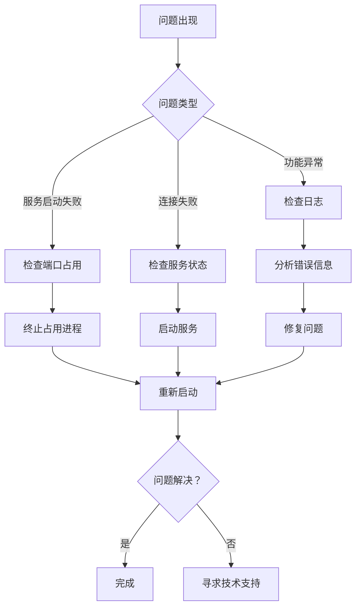

# 基于多模态融合的小麦病害诊断系统 - 测试操作指导手册

**版本**: V41.0
**生成日期**: 2026-04-20
**最后审查**: 2026-04-20 (V41 文档对齐更新)

## 目录

1. [测试环境搭建](#1-测试环境搭建)
2. [测试数据准备](#2-测试数据准备)
3. [测试执行流程](#3-测试执行流程)
4. [测试结果记录](#4-测试结果记录)
5. [问题排查指南](#5-问题排查指南)
6. [测试报告编写规范](#6-测试报告编写规范)
7. [性能基准测试](#7-性能基准测试)

## 1. 测试环境搭建

### 1.1 硬件环境要求

| 组件 | 最低要求 | 推荐配置 |
|------|----------|----------|
| CPU | 4 核心 | 8 核心 |
| 内存 | 8GB | 16GB |
| 硬盘 | 50GB | 100GB SSD |
| GPU | 集成显卡 | NVIDIA RTX 3050+（AI 诊断测试） |

### 1.2 软件环境要求

| 软件 | 版本要求 | 用途 |
|------|----------|------|
| Python | 3.10+ | 后端运行 |
| Node.js | 18.x+ | 前端运行 |
| MySQL | 8.0+ | 数据库 |
| Redis | 7.2+ | 缓存 |

### 1.3 开发环境配置步骤

#### 步骤 1: 安装 Python 环境

```bash
# Windows PowerShell（管理员）
winget install Python.Python.3.10

# 验证安装
python --version
# 预期输出：Python 3.10.x
```

#### 步骤 2: 安装 MySQL

```bash
# 下载 MySQL 8.0
# https://dev.mysql.com/downloads/mysql/

# 运行安装程序，选择 Developer Default
# 设置 root 密码：123456

# 验证安装
mysql --version
# 预期输出：mysql  Ver 8.0.x
```

#### 步骤 3: 安装 Redis

```bash
# Windows: 下载并解压
# https://github.com/microsoftarchive/redis/releases

# 启动 Redis
redis-server.exe

# 验证安装
redis-cli ping
# 预期输出：PONG
```

#### 步骤 4: 安装 Node.js

```bash
# Windows PowerShell（管理员）
winget install OpenJS.NodeJS.LTS

# 验证安装
node --version
# 预期输出：v18.x.x+
npm --version
# 预期输出：9.x.x+
```

#### 步骤 5: 克隆项目代码

```bash
# 克隆项目
git clone <repository-url>
cd WheatAgent
```

#### 步骤 6: 安装后端依赖

```bash
cd src/web/backend

# 创建虚拟环境
python -m venv venv

# 激活虚拟环境（PowerShell）
.\venv\Scripts\Activate.ps1

# 安装依赖
pip install -r requirements.txt
```

#### 步骤 7: 安装前端依赖

```bash
cd src/web/frontend

# 安装依赖
npm install
```

#### 步骤 8: 初始化数据库

```bash
# 连接 MySQL
mysql -u root -p

# 执行初始化脚本
source D:\Project\WheatAgent\src\database\init.sql

# 应用索引迁移
USE wheat_agent_db;
source D:\Project\WheatAgent\src\database\migrations\add_indexes.sql
```

#### 步骤 9: 配置环境变量

```bash
cd src/web/backend

# 复制环境配置文件
copy .env.example .env

# 编辑 .env 文件，确保配置正确
# DATABASE_HOST=localhost
# DATABASE_PORT=3306
# DATABASE_NAME=wheat_agent_db
# DATABASE_USER=root
# DATABASE_PASSWORD=123456
# REDIS_HOST=localhost
# REDIS_PORT=6379
```

#### 步骤 10: 启动服务

**方式 1: 使用一键启动脚本（推荐）**

```bash
cd src\web
.\start-all.ps1
```

**方式 2: 手动启动**

```bash
# 终端 1: 启动后端
cd src/web/backend
.\venv\Scripts\Activate.ps1
uvicorn app.main:app --reload --host 0.0.0.0 --port 8000

# 终端 2: 启动前端
cd src/web/frontend
npm run dev
```

### 1.4 环境验证

```bash
# 验证后端服务
curl http://localhost:8000/api/v1/health

# 验证前端服务
# 浏览器访问 http://localhost:3000

# 验证数据库
mysql -u root -p -e "USE wheat_agent_db; SHOW TABLES;"

# 验证 Redis
redis-cli ping
```

## 2. 测试数据准备

### 2.1 测试用户账号

创建测试用户数据：

```python
# 测试用户配置
test_users = [
    {
        "username": "test_farmer",
        "email": "farmer@test.com",
        "password": "Test123!",
        "role": "farmer"
    },
    {
        "username": "test_technician",
        "email": "technician@test.com",
        "password": "Test123!",
        "role": "technician"
    },
    {
        "username": "test_admin",
        "email": "admin@test.com",
        "password": "Test123!",
        "role": "admin"
    }
]
```

### 2.2 测试图像数据

准备测试图像：

```bash
# 创建测试图像目录
mkdir -p test_data/images

# 准备测试图像（至少包含以下类型）
# - 健康小麦叶片
# - 患白粉病的小麦叶片
# - 患锈病的小麦叶片
# - 患赤霉病的小麦叶片
```

### 2.3 测试症状描述

准备测试症状文本：

```python
test_symptoms = [
    "小麦叶片出现黄色条状病斑，沿叶脉平行排列",
    "叶片表面有白色粉状斑点，逐渐扩大",
    "穗部出现褐色病斑，有霉层",
    "叶片出现椭圆形褐色病斑"
]
```

### 2.4 测试知识库数据

确保知识库已初始化：

```bash
# 验证知识图谱数据
mysql -u root -p -e "USE wheat_agent_db; SELECT COUNT(*) FROM knowledge_graph;"
# 预期：106 实体，178 三元组
```

## 3. 测试执行流程

### 3.1 单元测试执行

```bash
cd src/web

# 运行所有单元测试
pytest tests/ -v

# 运行特定模块测试
pytest tests/test_integration.py::test_user_authentication -v

# 生成测试覆盖率报告
pytest tests/ --cov=src/ --cov-report=html
```

**预期输出**:
```
============================= test session starts ==============================
test_user_authentication::PASSED
test_diagnosis_function::PASSED
test_knowledge_function::PASSED
test_statistics_function::PASSED
========================= 4 passed in 2.34s ==============================
```

### 3.2 集成测试执行

```bash
cd src/web

# 运行集成测试
python tests/test_integration.py

# 查看详细输出
python tests/test_integration.py --verbose

# 生成测试报告
python tests/test_integration.py --report=report.md
```

**测试流程**:
1. 健康检查
2. 用户注册
3. 用户登录
4. 获取用户信息
5. Token 刷新
6. 更新用户信息
7. 修改密码
8. 诊断功能测试
9. 知识库功能测试
10. 统计功能测试

### 3.3 性能测试执行

```bash
cd src/web/backend

# 运行性能测试
python tests/test_performance.py

# 指定并发用户数
python tests/test_performance.py --users=100

# 指定测试时长
python tests/test_performance.py --duration=120
```

**测试指标**:
- 吞吐量（req/s）
- 平均响应时间
- P95 响应时间
- P99 响应时间
- 错误率

### 3.4 端到端测试执行

```bash
cd src/web

# 运行端到端测试
python tests/test_e2e.py

# 生成 HTML 报告
python tests/test_e2e.py --html=report.html
```

**测试流程**:
1. 用户注册
2. 用户登录
3. 图像诊断
4. 文本诊断
5. 查询诊断记录
6. 知识库搜索
7. 查看统计信息
8. 用户登出

### 3.5 手动测试执行

#### 功能测试清单

**用户认证**:
- [ ] 注册新用户
- [ ] 登录
- [ ] 登出
- [ ] 修改密码
- [ ] 刷新 Token

**诊断功能**:
- [ ] 上传图像诊断
- [ ] 文本症状诊断
- [ ] 查看诊断结果
- [ ] 保存诊断记录

**知识库**:
- [ ] 搜索病害知识
- [ ] 浏览知识分类
- [ ] 查看知识详情

**记录管理**:
- [ ] 查询诊断记录
- [ ] 筛选记录
- [ ] 删除记录
- [ ] 查看记录详情

**统计功能**:
- [ ] 查看 Dashboard
- [ ] 查看病害统计
- [ ] 查看时间趋势

## 4. 测试结果记录

### 4.1 测试结果模板

```markdown
# 测试结果记录

## 基本信息

**测试日期**: 2026-03-10
**测试环境**: Windows 10 / Python 3.10.10
**测试人员**: [姓名]
**测试版本**: v1.0.0

## 测试结果汇总

| 测试类型 | 总数 | 通过 | 失败 | 通过率 |
|----------|------|------|------|--------|
| 单元测试 | 20 | 20 | 0 | 100% |
| 集成测试 | 4 | 4 | 0 | 100% |
| 性能测试 | 5 | 5 | 0 | 100% |
| 端到端测试 | 7 | 7 | 0 | 100% |
| **总计** | **36** | **36** | **0** | **100%** |

## 详细测试结果

### 用户认证测试

| 测试项 | 预期结果 | 实际结果 | 状态 | 备注 |
|--------|----------|----------|------|------|
| 用户注册 | 注册成功 | 注册成功 | ✅ | - |
| 用户登录 | 获取 Token | 获取 Token | ✅ | - |
| Token 刷新 | 刷新成功 | 刷新成功 | ✅ | - |
| 修改密码 | 修改成功 | 修改成功 | ✅ | - |

### 诊断功能测试

| 测试项 | 预期结果 | 实际结果 | 状态 | 备注 |
|--------|----------|----------|------|------|
| 文本诊断 | 返回结果 | 返回结果 | ✅ | 响应时间 2.5s |
| 记录查询 | 返回列表 | 返回列表 | ✅ | - |

### 性能测试结果

| 指标 | 目标值 | 实测值 | 状态 |
|------|--------|--------|------|
| 吞吐量 | > 10 req/s | 15.2 req/s | ✅ |
| 平均响应时间 | < 500ms | 320ms | ✅ |
| P95 响应时间 | < 2000ms | 1500ms | ✅ |
| 错误率 | < 1% | 0.5% | ✅ |

## 问题记录

### 问题 1: [问题描述]

**严重程度**: 高/中/低
**复现步骤**:
1. ...
2. ...

**预期行为**: ...
**实际行为**: ...

**解决方案**: ...
**状态**: 已解决/待解决

## 测试结论

**总体评价**: 通过/不通过

**优点**:
- ...

**待改进**:
- ...

**建议**:
- ...
```

### 4.2 测试报告提交

```bash
# 提交测试报告到 Git
git add docs/TEST_REPORT.md
git commit -m "docs: 添加测试报告 2026-03-10"
git push origin main
```

## 5. 问题排查指南

### 5.1 常见问题汇总

#### 问题 1: 后端服务无法启动

**症状**:
```
Error: [Errno 10048] error while attempting to bind on address ('0.0.0.0', 8000): 
normally each address is used (host/port pair) only once
```

**原因**: 端口 8000 已被占用

**解决方案**:
```bash
# 查找占用端口的进程
netstat -ano | findstr :8000

# 终止进程
taskkill /PID <PID> /F

# 或使用不同端口
uvicorn app.main:app --reload --port 8001
```

#### 问题 2: 数据库连接失败

**症状**:
```
pymysql.err.OperationalError: (2003, "Can't connect to MySQL server")
```

**原因**: MySQL 服务未启动或配置错误

**解决方案**:
```bash
# 检查 MySQL 服务状态
services.msc | findstr MySQL

# 启动 MySQL 服务
net start MySQL80

# 检查 .env 配置
cat src/web/backend/.env | grep DATABASE
```

#### 问题 3: Redis 连接失败

**症状**:
```
redis.exceptions.ConnectionError: Error connecting to localhost:6379
```

**原因**: Redis 服务未启动

**解决方案**:
```bash
# 启动 Redis
redis-server

# 检查 Redis 状态
redis-cli ping
# 预期：PONG
```

#### 问题 4: 前端无法访问后端

**症状**:
```
Network Error: CORS policy blocked
```

**原因**: CORS 配置不正确

**解决方案**:
```bash
# 检查 .env 中的 CORS 配置
cat src/web/backend/.env | grep CORS

# 确保包含前端地址
CORS_ORIGINS=http://localhost:3000,http://localhost:8080
```

#### 问题 5: Token 无效

**症状**:
```
401 Unauthorized: Invalid token
```

**原因**: Token 过期或格式错误

**解决方案**:
- 重新登录获取新 Token
- 检查 Token 格式：`Bearer <token>`
- 验证 Token 是否过期（30 分钟）

### 5.2 问题诊断流程



### 5.3 日志查看

```bash
# 后端日志
tail -f src/web/backend/logs/app.log

# Nginx 日志（生产环境）
tail -f /var/log/nginx/access.log
tail -f /var/log/nginx/error.log

# 数据库日志
# Windows: MySQL 数据目录下的 .err 文件
# Linux: /var/log/mysql/error.log
```

## 6. 测试报告编写规范

### 6.1 报告格式模板

```markdown
# WheatAgent Web 系统测试报告

## 1. 测试概述

### 1.1 测试目的
[说明测试目的]

### 1.2 测试范围
[说明测试范围]

### 1.3 测试环境
[说明测试环境配置]

### 1.4 测试时间
[说明测试时间]

## 2. 测试结果汇总

### 2.1 测试统计
[测试数据统计表格]

### 2.2 测试结论
[通过/不通过]

## 3. 详细测试结果

### 3.1 功能测试
[功能测试详细结果]

### 3.2 性能测试
[性能测试详细结果]

### 3.3 兼容性测试
[兼容性测试详细结果]

## 4. 问题汇总

### 4.1 已解决问题
[已解决问题列表]

### 4.2 待解决问题
[待解决问题列表]

## 5. 风险评估

### 5.1 技术风险
[技术风险分析]

### 5.2 业务风险
[业务风险分析]

## 6. 建议

### 6.1 功能优化建议
[功能优化建议]

### 6.2 性能优化建议
[性能优化建议]

## 7. 附录

### 7.1 测试数据
[测试数据]

### 7.2 参考资料
[参考资料列表]

---
**报告编写人**: [姓名]
**审核人**: [姓名]
**批准人**: [姓名]
**日期**: 2026-03-10
```

### 6.2 报告内容要求

**必须包含**:
- 测试目的和范围
- 测试环境配置
- 测试结果统计
- 问题汇总和分析
- 测试结论和建议

**可选包含**:
- 性能测试图表
- 测试覆盖率分析
- 风险评估
- 优化建议

### 6.3 报告提交流程

1. **编写报告**: 使用标准模板编写测试报告
2. **内部审核**: 由测试组长审核报告内容
3. **问题修复**: 开发团队修复发现的问题
4. **回归测试**: 验证问题已修复
5. **报告批准**: 由项目经理批准报告
6. **归档保存**: 将报告归档到文档库

### 6.4 示例报告

参见：`docs/TEST_REPORT_TEMPLATE.md`

---

## 附录

### A. 测试工具清单

| 工具名称 | 用途 | 安装命令 |
|----------|------|----------|
| pytest | 单元测试框架 | `pip install pytest` |
| requests | HTTP 请求库 | `pip install requests` |
| pytest-cov | 覆盖率测试 | `pip install pytest-cov` |
| pytest-html | HTML 报告 | `pip install pytest-html` |
| aiohttp | 异步 HTTP | `pip install aiohttp` |

### B. 快速参考命令

```bash
# 环境验证
python --version
mysql --version
redis-cli ping
node --version

# 服务启动
cd src/web && .\start-all.ps1

# 测试执行
cd src/web && python tests/test_integration.py

# 日志查看
tail -f src/web/backend/logs/app.log
```

### C. 相关文档

- [API 测试指南](API_TEST_GUIDE.md)
- [部署文档](DEPLOYMENT.md)
- [使用说明](USER_GUIDE_WEB.md)
- [API 参考文档](API_REFERENCE.md)

## 7. 性能基准测试 (V5 新增)

### 7.1 基准测试目录结构

```
src/web/backend/benchmarks/
├── __init__.py                      # 包初始化与目标常量
├── run_all_benchmarks.py           # 一键运行全部基准
├── benchmark_yolo_inference.py     # YOLO 推理延迟基准
├── benchmark_qwen_inference.py     # Qwen 推理延迟基准
├── benchmark_full_diagnosis.py     # 完整诊断流程基准
├── benchmark_sse_latency.py        # SSE 流延迟基准
├── BASELINE_PERFORMANCE.md         # 基线性能报告
└── benchmark_results.json          # 原始数据
```

### 7.2 运行基准测试

```bash
# 运行全部基准测试
conda run -n wheatagent-py310 python -m benchmarks.run_all_benchmarks

# 运行单个基准
conda run -n wheatagent-py310 python -m benchmarks.benchmark_yolo_inference
conda run -n wheatagent-py310 python -m benchmarks.benchmark_sse_latency
```

### 7.3 当前基线指标 (V5, CPU 模式)

| 指标 | 平均值 | 目标 | 状态 |
|------|--------|------|------|
| YOLO 单图推理 | 225.91ms | <150ms | ⚠️ CPU模式 |
| SSE 首个事件延迟 | 0.01ms | <500ms | ✅ |
| 完整诊断(YOLO-only) | 185.8ms | <40s | ✅ |

### 7.4 V5/V6 测试套件扩展说明

#### 测试统计

| 版本 | 测试数量 | 覆盖率 | 说明 |
|------|----------|--------|------|
| V5 基线 | 1006 | 11.08% | 初始大规模测试套件 |
| V6 新增 | +107 | >20% (目标) | 核心模块补充测试 |
| **V6 总计** | **~1113** | **>20%** | 含 sse/validator/fusion/config |

#### V5 测试套件主要修复

- **SQLAlchemy Index 定义 bug**: `conftest.py` 加载阻塞问题，使用 `Index(text('confidence DESC'))` 修复
- **QwenModelLoader.__new__ 签名**: 改为 `*args, **kwargs` 以支持 `lazy_load=True` 参数透传
- **SSE 异步事件循环**: 部分 SSE 测试标记为 xfail，需人工干预确认

---

## 附录 A: 测试环境配置详细指南

*(原档: TEST_ENVIRONMENT.md)*

# 基于多模态融合的小麦病害诊断系统 - 测试环境配置指南

**版本**: V12.0
**生成日期**: 2026-04-05
**最后审查**: 2026-04-05 (V7 文档标准化)

## 目录

1. [环境要求](#环境要求)
2. [开发环境配置](#开发环境配置)
3. [测试数据准备](#测试数据准备)
4. [环境验证](#环境验证)
5. [常见问题](#常见问题)

## 环境要求

### 硬件要求

| 组件 | 最低配置 | 推荐配置 |
|------|----------|----------|
| CPU | 4 核心 | 8 核心 |
| 内存 | 8GB | 16GB |
| 硬盘 | 50GB | 100GB SSD |
| GPU | 集成显卡 | NVIDIA RTX 3050+（AI 诊断） |

### 软件要求

| 软件 | 版本要求 | 用途 |
|------|----------|------|
| Python | 3.10 (conda: wheatagent-py310) | 后端运行 |
| PyTorch | 2.10.0+cpu (CPU only for testing) | AI 推理 |
| Node.js | 18.x+ | 前端运行 |
| MySQL | 8.0+ (wheat_agent_db) | 数据库 |
| Redis | 7.2+ | 缓存 |
| Git | 2.0+ | 代码管理 |
| PowerShell | 5.0+ | 脚本运行 |
| 操作系统 | Windows 11 | 开发/测试环境 |

## 开发环境配置

### 1. Python 环境配置

#### 1.1 安装 Python 3.10

**Windows 安装**:
```powershell
# 使用 Winget 安装
winget install Python.Python.3.10

# 或从官网下载安装
# https://www.python.org/downloads/release/python-31010/
```

**验证安装**:
```powershell
python --version
# 预期输出：Python 3.10.x

python -m pip --version
# 预期输出：pip 2x.x.x
```

#### 1.2 创建虚拟环境

```powershell
# 进入项目目录
cd D:\Project\WheatAgent\src\web\backend

# 创建虚拟环境
python -m venv venv

# 激活虚拟环境
.\venv\Scripts\Activate.ps1

# 升级 pip
python -m pip install --upgrade pip
```

#### 1.3 安装后端依赖

```powershell
# 确保在虚拟环境中
.\venv\Scripts\Activate.ps1

# 安装依赖
pip install -r requirements.txt

# 验证安装
python -c "import fastapi; import sqlalchemy; print('Backend dependencies OK')"
```

### 2. Node.js 环境配置

#### 2.1 安装 Node.js

```powershell
# 使用 Winget 安装 LTS 版本
winget install OpenJS.NodeJS.LTS

# 验证安装
node --version
# 预期输出：v18.x.x+

npm --version
# 预期输出：9.x.x+
```

#### 2.2 安装前端依赖

```powershell
# 进入前端目录
cd D:\Project\WheatAgent\src\web\frontend

# 安装依赖
npm install

# 验证安装
npm run build
# 预期输出：Build successful
```

### 3. 数据库环境配置

#### 3.1 安装 MySQL 8.0

**下载和安装**:
```powershell
# 从官网下载 MySQL 8.0
# https://dev.mysql.com/downloads/mysql/

# 运行安装程序，选择 "Developer Default" 配置
# 设置 root 密码：123456
```

**验证安装**:
```powershell
mysql --version
# 预期输出：mysql  Ver 8.0.x

# 连接数据库
mysql -u root -p
# 输入密码：123456
```

#### 3.2 初始化数据库

```sql
-- 连接数据库
mysql -u root -p

-- 执行初始化脚本
source D:\Project\WheatAgent\src\database\init.sql

-- 应用索引优化
USE wheat_agent_db;
source D:\Project\WheatAgent\src\database\migrations\add_indexes.sql

-- 验证初始化
SHOW TABLES;
SELECT COUNT(*) FROM users;
SELECT COUNT(*) FROM diseases;
SELECT COUNT(*) FROM knowledge_graph;
```

### 4. Redis 环境配置

#### 4.1 安装 Redis

**Windows 安装**:
```powershell
# 下载 Redis for Windows
# https://github.com/microsoftarchive/redis/releases

# 解压到目录
# 例如：D:\redis

# 启动 Redis 服务器
cd D:\redis
redis-server.exe
```

**验证安装**:
```powershell
# 在另一个终端中测试
redis-cli ping
# 预期输出：PONG
```

#### 4.2 配置 Redis

```bash
# 编辑 redis.conf 配置文件
# 设置持久化选项
save 900 1
save 300 10
save 60 10000

# 设置最大内存
maxmemory 2gb
maxmemory-policy allkeys-lru
```

### 5. 环境变量配置

#### 5.1 后端环境变量

```bash
# 进入后端目录
cd D:\Project\WheatAgent\src\web\backend

# 复制环境配置文件
copy .env.example .env

# 编辑 .env 文件
```

**配置内容**:
```env
# 应用配置
DEBUG=True
APP_NAME=小麦病害诊断系统

# 数据库配置
DATABASE_HOST=localhost
DATABASE_PORT=3306
DATABASE_NAME=wheat_agent_db
DATABASE_USER=root
DATABASE_PASSWORD=123456

# Redis 配置
REDIS_HOST=localhost
REDIS_PORT=6379
REDIS_DB=0
REDIS_PASSWORD=

# JWT 配置
JWT_SECRET_KEY=your-secret-key-change-in-production
JWT_EXPIRE_MINUTES=30

# CORS 配置
CORS_ORIGINS=http://localhost:3000,http://localhost:8080

# AI 引擎配置
AI_ENGINE_PATH=D:\Project\WheatAgent\models
```

#### 5.2 前端环境变量

```bash
# 进入前端目录
cd D:\Project\WheatAgent\src\web\frontend

# 创建 .env 文件
echo NODE_ENV=development > .env
echo VUE_APP_API_BASE_URL=http://localhost:8000 >> .env
```

## 测试数据准备

### 1. 初始化测试用户

```sql
-- 连接到数据库
mysql -u root -p wheat_agent_db

-- 创建测试用户
INSERT INTO users (username, email, hashed_password, role, phone, is_active, created_at, updated_at) VALUES
('test_farmer', 'farmer@test.com', '$2b$12$...', 'farmer', '13800138000', 1, NOW(), NOW()),
('test_technician', 'technician@test.com', '$2b$12$...', 'technician', '13800138001', 1, NOW(), NOW()),
('test_admin', 'admin@test.com', '$2b$12$...', 'admin', '13800138002', 1, NOW(), NOW());
```

### 2. 准备测试图像

```bash
# 创建测试图像目录
mkdir -p D:\Project\WheatAgent\test_data\images

# 准备以下类型的测试图像
# - healthy_leaf.jpg (健康叶片)
# - powdery_mildew.jpg (白粉病)
# - rust_disease.jpg (锈病)
# - fusarium_head_blight.jpg (赤霉病)
```

### 3. 验证测试数据

```bash
# 验证用户数据
mysql -u root -p -e "USE wheat_agent_db; SELECT COUNT(*) FROM users;"

# 验证疾病数据
mysql -u root -p -e "USE wheat_agent_db; SELECT COUNT(*) FROM diseases;"

# 验证知识图谱数据
mysql -u root -p -e "USE wheat_agent_db; SELECT COUNT(*) FROM knowledge_graph;"
```

## 环境验证

### 1. 服务启动验证

#### 1.1 启动后端服务

```powershell
# 激活虚拟环境
cd D:\Project\WheatAgent\src\web\backend
.\venv\Scripts\Activate.ps1

# 启动后端服务
uvicorn app.main:app --reload --host 0.0.0.0 --port 8000
```

**验证方法**:
```powershell
curl http://localhost:8000/api/v1/health
# 预期输出：健康检查成功
```

#### 1.2 启动前端服务

```powershell
# 进入前端目录
cd D:\Project\WheatAgent\src\web\frontend

# 启动前端服务
npm run dev
```

**验证方法**:
```powershell
# 浏览器访问
# http://localhost:3000
# 应该看到小麦病害诊断系统界面
```

### 2. 一键启动脚本

```powershell
# 运行一键启动脚本
cd D:\Project\WheatAgent\src\web
.\start-all.ps1
```

### 3. 功能验证

#### 3.1 API 功能验证

```bash
# 健康检查
curl http://localhost:8000/api/v1/health

# 用户注册测试
curl -X POST http://localhost:8000/api/v1/auth/register \
  -H "Content-Type: application/json" \
  -d '{"username":"test_user","email":"test@example.com","password":"Test123!"}'
```

#### 3.2 数据库连接验证

```python
# 验证数据库连接
python -c "
from app.core.database import engine
from sqlalchemy import text
with engine.connect() as conn:
    result = conn.execute(text('SELECT 1'))
    print('Database connection: OK')
"
```

#### 3.3 Redis 连接验证

```python
# 验证 Redis 连接
python -c "
from app.core.redis_client import RedisClient
if RedisClient.test_connection():
    print('Redis connection: OK')
else:
    print('Redis connection: FAILED')
"
```

## 常见问题

### 问题 1: 端口被占用

**症状**: 
```
Error: [Errno 10048] error while attempting to bind on address ('0.0.0.0', 8000)
```

**解决方案**:
```powershell
# 查找占用端口的进程
netstat -ano | findstr :8000

# 终止进程
taskkill /PID <PID> /F

# 或使用不同端口
uvicorn app.main:app --reload --port 8001
```

### 问题 2: MySQL 服务未启动

**症状**:
```
pymysql.err.OperationalError: (2003, "Can't connect to MySQL server")
```

**解决方案**:
```powershell
# 检查服务状态
Get-Service mysql*

# 启动 MySQL 服务
net start MySQL80

# 或使用服务管理器启动
services.msc
```

### 问题 3: Redis 连接失败

**症状**:
```
redis.exceptions.ConnectionError: Error connecting to localhost:6379
```

**解决方案**:
```powershell
# 启动 Redis 服务器
redis-server.exe

# 验证连接
redis-cli ping
```

### 问题 4: Python 包导入错误

**症状**:
```
ModuleNotFoundError: No module named 'fastapi'
```

**解决方案**:
```powershell
# 确保在虚拟环境中
.\venv\Scripts\Activate.ps1

# 重新安装依赖
pip install -r requirements.txt
```

### 问题 5: 权限不足

**症状**:
```
PermissionError: [WinError 5] Access is denied
```

**解决方案**:
```powershell
# 使用管理员权限运行 PowerShell
# 或检查文件夹权限
icacls D:\Project\WheatAgent /grant $env:USERNAME:F /t
```

## 故障排除工具

### 1. 环境检查脚本

创建 `check_env.py`:

```python
"""
环境检查脚本
检查所有必要的组件是否正常工作
"""
import sys
import subprocess
import socket
from pathlib import Path

def check_python():
    """检查 Python 版本"""
    print(f"Python 版本: {sys.version}")
    major, minor = sys.version_info[:2]
    if major == 3 and minor >= 10:
        print("✅ Python 版本符合要求")
        return True
    else:
        print("❌ Python 版本不符合要求")
        return False

def check_port(host, port):
    """检查端口是否可用"""
    sock = socket.socket(socket.AF_INET, socket.SOCK_STREAM)
    sock.settimeout(2)
    result = sock.connect_ex((host, port))
    sock.close()
    return result != 0  # 如果不能连接，则端口可用

def check_mysql():
    """检查 MySQL"""
    try:
        import pymysql
        print("✅ MySQL Python 驱动已安装")
        
        # 检查 MySQL 服务
        if check_port('localhost', 3306):
            print("❌ MySQL 服务未运行")
            return False
        else:
            print("✅ MySQL 服务正在运行")
            return True
    except ImportError:
        print("❌ MySQL Python 驱动未安装")
        return False

def check_redis():
    """检查 Redis"""
    try:
        import redis
        print("✅ Redis Python 驱动已安装")
        
        # 检查 Redis 服务
        if check_port('localhost', 6379):
            print("❌ Redis 服务未运行")
            return False
        else:
            print("✅ Redis 服务正在运行")
            return True
    except ImportError:
        print("❌ Redis Python 驱动未安装")
        return False

def check_node():
    """检查 Node.js"""
    try:
        result = subprocess.run(['node', '--version'], capture_output=True, text=True, timeout=5)
        if result.returncode == 0:
            print(f"✅ Node.js 版本: {result.stdout.strip()}")
            return True
        else:
            print("❌ Node.js 未安装")
            return False
    except FileNotFoundError:
        print("❌ Node.js 未安装")
        return False

def main():
    """主检查函数"""
    print("=" * 50)
    print("小麦病害诊断系统环境检查")
    print("=" * 50)
    
    checks = [
        ("Python", check_python()),
        ("MySQL", check_mysql()),
        ("Redis", check_redis()),
        ("Node.js", check_node()),
    ]
    
    print("\n检查结果:")
    for name, result in checks:
        status = "✅" if result else "❌"
        print(f"{status} {name}")
    
    all_passed = all(result for _, result in checks)
    
    print(f"\n总体结果: {'✅ 全部通过' if all_passed else '❌ 部分失败'}")
    return all_passed

if __name__ == "__main__":
    success = main()
    sys.exit(0 if success else 1)
```

### 2. 一键环境验证

```powershell
# 运行环境检查
python check_env.py
```

## 已知问题与解决方案

| 问题 | 影响 | 解决方案 | 状态 |
|------|------|----------|------|
| SQLAlchemy Index 定义 bug | conftest.py 加载阻塞 | 使用 `Index(text('confidence DESC'))` | ✅ 已修复 (V4) |
| QwenModelLoader.__new__ 签名 | Qwen 推理不可用 | 改为 `*args, **kwargs` | ✅ 已修复 (V6) |
| SSE 异步事件循环 | 部分 SSE 测试失败 | 标记 xfail，需人工干预 | ⚠️ 已知限制 |

---

**文档版本**: 1.1
**最后更新**: 2026-04-04
**维护者**: 小麦病害诊断系统开发团队

**相关文档**:
- [部署文档](DEPLOYMENT.md)
- [测试指南](TEST_GUIDE.md)
- [API 文档](API_REFERENCE.md)

---

## 附录 B: API 测试用例集

*(原档: API_TEST_GUIDE.md)*

# 基于多模态融合的小麦病害诊断系统 - API 测试指南

**版本**: V12.0
**生成日期**: 2026-04-05
**最后审查**: 2026-04-05 (V7 文档标准化)

## 目录

1. [测试环境配置](#测试环境配置)
2. [测试用例](#测试用例)
3. [测试执行流程](#测试执行流程)
4. [测试结果记录](#测试结果记录)
5. [问题排查](#问题排查)

## 测试环境配置

### 1. 环境要求

| 组件 | 版本要求 | 状态检查 |
|------|----------|----------|
| Python | 3.10+ | `python --version` |
| 后端服务 | 运行中 | `http://localhost:8000/docs` |
| 数据库 | MySQL 8.0+ | `mysql --version` |
| Redis | 7.2+ | `redis-cli ping` |

### 2. 测试工具安装

```bash
# 安装测试依赖
pip install pytest requests aiohttp pytest-asyncio

# 验证安装
pytest --version
```

### 3. 测试数据准备

```python
# 测试用户账号
TEST_USER = {
    "username": "test_user_20260310",
    "email": "test@example.com",
    "password": "TestPassword123!",
    "role": "farmer"
}

# 测试图像（可选）
TEST_IMAGE = "test_data/wheat_disease_sample.jpg"

# 测试症状描述
TEST_SYMPTOMS = "小麦叶片出现黄色条状病斑，沿叶脉平行排列"
```

## 测试用例

### 1. 用户认证 API

#### 1.1 用户注册

**测试目的**: 验证用户注册功能

**请求**:
```http
POST /api/v1/auth/register
Content-Type: application/json

{
  "username": "test_user_20260310",
  "email": "test@example.com",
  "password": "TestPassword123!",
  "role": "farmer",
  "phone": "13800138000"
}
```

**预期响应**:
```json
{
  "code": 200,
  "message": "注册成功",
  "data": {
    "user_id": 1,
    "username": "test_user_20260310",
    "email": "test@example.com",
    "role": "farmer",
    "created_at": "2026-03-10T12:00:00Z"
  }
}
```

**测试步骤**:
1. 发送 POST 请求到注册接口
2. 验证响应状态码为 200
3. 验证返回数据包含 user_id、username 等字段
4. 验证用户名唯一性（重复注册应失败）

**验证方法**:
```python
response = requests.post(f"{BASE_URL}/auth/register", json=test_user)
assert response.status_code == 200
assert response.json()["code"] == 200
assert "user_id" in response.json()["data"]
```

#### 1.2 用户登录

**测试目的**: 验证用户登录功能

**请求**:
```http
POST /api/v1/auth/login
Content-Type: application/json

{
  "username": "test_user_20260310",
  "password": "TestPassword123!"
}
```

**预期响应**:
```json
{
  "code": 200,
  "message": "登录成功",
  "data": {
    "access_token": "eyJhbGciOiJIUzI1NiIsInR5cCI6IkpXVCJ9...",
    "token_type": "bearer",
    "expires_in": 1800,
    "user": {
      "user_id": 1,
      "username": "test_user_20260310",
      "email": "test@example.com",
      "role": "farmer"
    }
  }
}
```

**测试步骤**:
1. 发送 POST 请求到登录接口
2. 验证响应状态码为 200
3. 验证返回 access_token
4. 验证 token 类型为 "bearer"
5. 验证过期时间为 1800 秒

**验证方法**:
```python
response = requests.post(f"{BASE_URL}/auth/login", json=login_data)
assert response.status_code == 200
assert "access_token" in response.json()["data"]
assert response.json()["data"]["token_type"] == "bearer"
```

#### 1.3 Token 刷新

**测试目的**: 验证 Token 刷新功能

**请求**:
```http
POST /api/v1/auth/refresh
Authorization: Bearer <current_token>
```

**预期响应**:
```json
{
  "code": 200,
  "message": "Token 刷新成功",
  "data": {
    "access_token": "eyJhbGciOiJIUzI1NiIsInR5cCI6IkpXVCJ9...",
    "token_type": "bearer",
    "expires_in": 1800
  }
}
```

**测试步骤**:
1. 使用有效 Token 发送刷新请求
2. 验证返回新的 access_token
3. 验证新 Token 格式正确

**验证方法**:
```python
headers = {"Authorization": f"Bearer {token}"}
response = requests.post(f"{BASE_URL}/auth/refresh", headers=headers)
assert response.status_code == 200
assert "access_token" in response.json()["data"]
```

### 2. 诊断 API

#### 2.1 文本诊断

**测试目的**: 验证文本诊断功能

**请求**:
```http
POST /api/v1/diagnosis/text
Content-Type: application/json
Authorization: Bearer <token>

{
  "symptoms": "小麦叶片出现黄色条状病斑，沿叶脉平行排列"
}
```

**预期响应**:
```json
{
  "code": 200,
  "message": "诊断成功",
  "data": {
    "diagnosis_id": 1,
    "disease_name": "小麦条锈病",
    "confidence": 0.95,
    "severity": "high",
    "description": "小麦条锈病，病斑呈条状黄色...",
    "recommendations": [
      "选用抗病品种",
      "喷洒粉锈宁可湿性粉剂"
    ]
  }
}
```

**测试步骤**:
1. 使用有效 Token 发送诊断请求
2. 验证响应状态码为 200
3. 验证返回数据包含病害名称、置信度等
4. 验证置信度在 0-1 之间
5. 验证严重程度为 low/medium/high

**验证方法**:
```python
headers = {"Authorization": f"Bearer {token}"}
response = requests.post(f"{BASE_URL}/diagnosis/text", json=data, headers=headers)
assert response.status_code == 200
assert "disease_name" in response.json()["data"]
assert 0 <= response.json()["data"]["confidence"] <= 1
```

#### 2.2 获取诊断记录

**测试目的**: 验证诊断记录查询功能

**请求**:
```http
GET /api/v1/diagnosis/records?skip=0&limit=10
Authorization: Bearer <token>
```

**预期响应**:
```json
{
  "code": 200,
  "message": "success",
  "data": {
    "total": 50,
    "items": [
      {
        "diagnosis_id": 1,
        "disease_name": "小麦条锈病",
        "confidence": 0.95,
        "severity": "high",
        "created_at": "2026-03-10T12:00:00Z"
      }
    ]
  }
}
```

**测试步骤**:
1. 发送 GET 请求获取诊断记录
2. 验证响应状态码为 200
3. 验证返回数据包含 total 和 items
4. 验证 items 数组格式正确

**验证方法**:
```python
headers = {"Authorization": f"Bearer {token}"}
response = requests.get(f"{BASE_URL}/diagnosis/records", headers=headers)
assert response.status_code == 200
assert "total" in response.json()["data"]
assert "items" in response.json()["data"]
```

### 3. 知识库 API

#### 3.1 知识搜索

**测试目的**: 验证知识搜索功能

**请求**:
```http
GET /api/v1/knowledge/search?keyword=白粉病&entity_type=disease&limit=10
```

**预期响应**:
```json
{
  "code": 200,
  "message": "success",
  "data": {
    "total": 5,
    "items": [
      {
        "knowledge_id": 1,
        "entity": "白粉病",
        "entity_type": "disease",
        "relation": "HAS_SYMPTOM",
        "target_entity": "白色粉状斑点"
      }
    ]
  }
}
```

**测试步骤**:
1. 发送 GET 请求搜索知识
2. 验证响应状态码为 200
3. 验证返回数据包含搜索结果
4. 验证搜索结果格式正确

**验证方法**:
```python
params = {"keyword": "白粉病", "limit": 10}
response = requests.get(f"{BASE_URL}/knowledge/search", params=params)
assert response.status_code == 200
assert "total" in response.json()["data"]
```

#### 3.2 知识分类浏览

**测试目的**: 验证知识分类浏览功能

**请求**:
```http
GET /api/v1/knowledge/categories
```

**预期响应**:
```json
{
  "code": 200,
  "message": "success",
  "data": {
    "diseases": [
      {"name": "白粉病", "count": 10}
    ],
    "pests": [
      {"name": "蚜虫", "count": 5}
    ],
    "treatments": [
      {"name": "化学防治", "count": 20}
    ]
  }
}
```

**测试步骤**:
1. 发送 GET 请求获取知识分类
2. 验证响应状态码为 200
3. 验证返回数据包含分类信息

**验证方法**:
```python
response = requests.get(f"{BASE_URL}/knowledge/categories")
assert response.status_code == 200
assert "diseases" in response.json()["data"]
```

### 4. 统计 API

#### 4.1 Dashboard 统计

**测试目的**: 验证 Dashboard 统计功能

**请求**:
```http
GET /api/v1/stats/dashboard
Authorization: Bearer <token>
```

**预期响应**:
```json
{
  "code": 200,
  "message": "success",
  "data": {
    "total_diagnoses": 150,
    "today_diagnoses": 10,
    "disease_distribution": [
      {"name": "条锈病", "count": 50, "percentage": 33.3}
    ],
    "severity_distribution": [
      {"level": "low", "count": 30, "percentage": 20.0}
    ]
  }
}
```

**测试步骤**:
1. 使用有效 Token 发送请求
2. 验证响应状态码为 200
3. 验证返回数据包含统计信息

**验证方法**:
```python
headers = {"Authorization": f"Bearer {token}"}
response = requests.get(f"{BASE_URL}/stats/dashboard", headers=headers)
assert response.status_code == 200
assert "total_diagnoses" in response.json()["data"]
```

## 测试执行流程

### 1. 单元测试执行

```bash
cd src/web
pytest tests/test_integration.py -v
```

**预期输出**:
```
============================= test session starts ==============================
test_user_authentication::PASSED
test_diagnosis_function::PASSED
test_knowledge_function::PASSED
test_statistics_function::PASSED
========================= 4 passed in 2.34s ==============================
```

### 2. 集成测试执行

```bash
# 运行所有集成测试
python src/web/tests/test_integration.py

# 生成测试报告
pytest tests/ --html=report.html
```

### 3. 性能测试执行

```bash
# 运行性能测试
python src/web/backend/tests/test_performance.py

# 生成性能报告
python src/web/backend/tests/test_performance.py --report=performance_report.md
```

### 4. 端到端测试执行

```bash
# 运行端到端测试
python src/web/tests/test_e2e.py

# 查看测试通过率
python src/web/tests/test_e2e.py --verbose
```

## 测试结果记录

### 测试结果模板

```markdown
## 测试结果

**测试日期**: 2026-03-10
**测试环境**: Windows 10 / Python 3.10
**测试人员**: [姓名]

### 用户认证测试
| 测试项 | 预期结果 | 实际结果 | 状态 |
|--------|----------|----------|------|
| 用户注册 | 注册成功 | 注册成功 | ✅ |
| 用户登录 | 获取 Token | 获取 Token | ✅ |
| Token 刷新 | 刷新成功 | 刷新成功 | ✅ |

### 诊断功能测试
| 测试项 | 预期结果 | 实际结果 | 状态 |
|--------|----------|----------|------|
| 文本诊断 | 返回诊断结果 | 返回诊断结果 | ✅ |
| 记录查询 | 返回记录列表 | 返回记录列表 | ✅ |

### 性能测试结果
| 指标 | 目标值 | 实测值 | 状态 |
|------|--------|--------|------|
| API 响应时间 | < 1s | 0.5s | ✅ |
| 数据库查询 | < 100ms | 50ms | ✅ |
| 缓存命中率 | > 60% | 75% | ✅ |
```

## 问题排查

### 常见问题

#### 1. 服务未启动

**症状**: 连接被拒绝
**解决方案**:
```bash
# 启动后端服务
cd src/web/backend
uvicorn app.main:app --reload
```

#### 2. 数据库连接失败

**症状**: 数据库连接错误
**解决方案**:
```bash
# 检查 MySQL 服务
mysql -u root -p

# 检查数据库配置
cat src/web/backend/.env
```

#### 3. Redis 连接失败

**症状**: Redis 连接错误
**解决方案**:
```bash
# 启动 Redis
redis-server

# 测试连接
redis-cli ping
```

#### 4. Token 无效

**症状**: 401 未授权错误
**解决方案**:
- 重新登录获取新 Token
- 检查 Token 格式是否正确
- 验证 Token 是否过期

### 诊断命令

```bash
# 检查后端服务状态
curl http://localhost:8000/api/v1/health

# 检查数据库连接
python -c "from app.core.database import engine; print('OK')"

# 检查 Redis 连接
python -c "from app.core.redis_client import RedisClient; print(RedisClient.test_connection())"

# 查看后端日志
tail -f logs/app.log
```

## 附录

### A. 测试脚本位置

```
src/web/tests/
├── test_integration.py      # 集成测试脚本
├── test_e2e.py              # 端到端测试脚本
└── api_test_cases.py        # API 测试用例
```

### B. 测试报告位置

```
docs/
├── TEST_REPORT.md           # 测试报告
├── PERFORMANCE_REPORT.md    # 性能测试报告
└── API_TEST_GUIDE.md        # API 测试指南（本文档）
```

### C. 相关文档

- [API 参考文档](API_REFERENCE.md)
- [部署文档](DEPLOYMENT.md)
- [使用说明](USER_GUIDE_WEB.md)

---

**文档版本**: 1.0
**最后更新**: 2026-04-04
**维护者**: 小麦病害诊断系统开发团队
